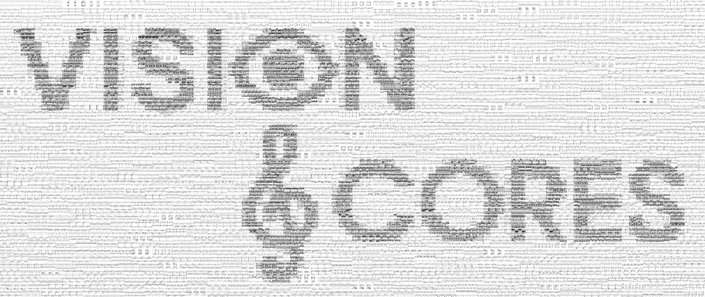

# VisionScores

**VisionScores** is a novel, system-segmented image score dataset specifically designed for machine learning applications in symbolic music processing. It represents the first dataset that captures the system-level structure of two-handed piano compositions, formatted for compatibility with modern machine learning frameworks.

The dataset was constructed to address the limitations of existing music score datasets, which are predominantly designed for Optical Music Recognition (OMR) tasks. **VisionScores** emphasizes structural consistency and format uniformity while preserving the semantic richness of musical scores. Its development was grounded on two foundational constraints: (1) content consistency, through the selection of two-handed piano compositions, and (2) format regularity, achieved through segmentation of systems from score pages into uniformly sized grayscale images.

The full methodology, motivation, and analysis are presented in the following paper:

**[VisionScores – A System-Segmented Image Score Dataset for Deep Learning Tasks](http://arxiv.org/abs/2506.23030)**

We invite readers to consult the full text for a comprehensive understanding of the dataset’s construction and applications.

## Structure of Dataset

Each sample in **VisionScores** is a grayscale image of dimensions **128 × 512 pixels**, saved in `.jpg` format. All samples represent **individual systems** extracted from two-handed piano sheet music. In addition to the image data, **VisionScores** includes detailed **metadata** for each system, comprising the title of the piece, composer, key (if available), IMSLP page reference, and a system index.

To provide both structural similarity and stylistic diversity, the dataset is divided into two distinct scenarios:

* **Sonatinas Scenario**: Contains 14,000 systems extracted from various Sonatina compositions by multiple composers. This scenario emphasizes stylistic similarity across different authors.
* **Franz Liszt Scenario**: Contains 10,810 systems extracted from diverse works by Franz Liszt, showcasing a wide range of compositional styles from a single composer.

These scenarios were designed to support controlled experimentation in symbolic music generation, layout analysis, and related tasks.

### Disclaimer
- As noted in the paper, **individual systems do not contain enough information to represent a work type or to characterize a composer**. These attributes emerge only in the context of complete, ordered sequences of systems.
- The **system index** in the metadata is relative to the set of valid segmented systems for each piece and **may not** match the original order in the score. This limitation results from the exclusion of incomplete or low-quality segments and will be addressed in future dataset updates.

## Accessing the Data

The curated dataset samples are accessible via *Hugging Face*:

* [Hugging Face Datasets](https://huggingface.co/datasets/alromz/VisionScores)

In addition to the curated and formatted samples, auxiliary materials including unsegmented full-page scores and non-formatted systems. This files are available through Google Drive due to file size constraints:

* [Google Drive – Auxiliary Files](https://drive.google.com/drive/folders/19ZJEfOZMDByBymQpXw3Y0Ys0Y4IwvZss?usp=drive_link)